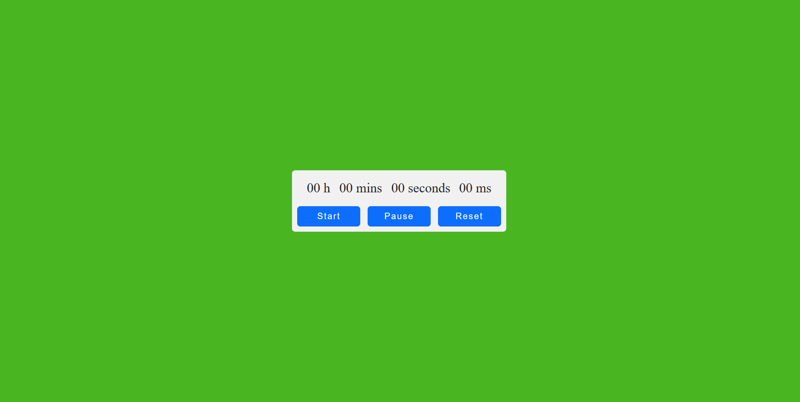

# Chronomètre

Un simple chronomètre avec affichage des heures, minutes, secondes et millisecondes, conçu en HTML, CSS et JavaScript.

## Fonctionnalités

- Démarrez le chronomètre en appuyant sur le bouton "Start".
- Mettez le chronomètre en pause en appuyant sur le bouton "Pause".
- Réinitialisez le chronomètre à zéro en appuyant sur le bouton "Reset".
- Affichage des heures, minutes, secondes et millisecondes.

## Aperçu

()


## Installation

1. Clonez ce dépôt  :

   ```bash
   git clone https://github.com/votre-utilisateur/chronometre.git

2. Ouvrez le fichier index.html dans votre navigateur web.

## Utilisation

- Appuyez sur le bouton **Start** pour Démarrer le chronomètre.
- Pour mettre le chronomètre en pause, appuyez sur le bouton **Pause**.
- Pour réinitialiser le chronomètre, appuyez sur le bouton  **Reset**.


## Author

[Rayane](https://github.com/RayaneC-01)